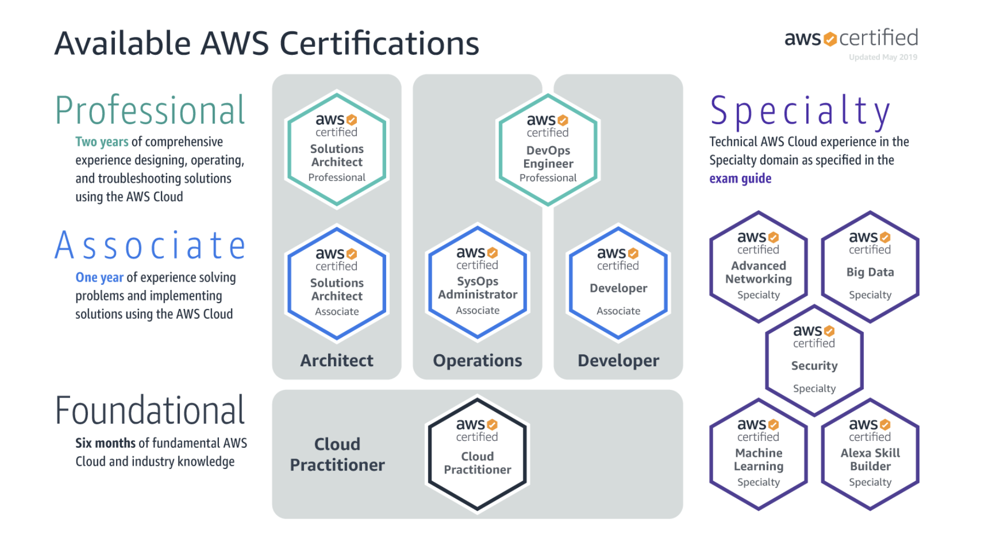

Architect Certification - Most popular

SysOps Certification - Most technical

Developer Certification - Most practical

[AWS Certified Cloud Practitioner Training 2020 - Full Course](https://www.youtube.com/watch?v=3hLmDS179YE)

[AWS Certified Solutions Architect - Associate 2020 (PASS THE EXAM!) | Ad-Free Course](https://www.youtube.com/watch?v=Ia-UEYYR44s)

[AWS Systems Manager Parameter Store Introduction](https://www.youtube.com/watch?v=3FUpyzc_raI&list=PLt1SIbA8guutEgXhvhHnwILnRlaG7nWJp)

[AWS Certified Developer - Associate 2020 (PASS THE EXAM!) | Ad-Free Course](https://www.youtube.com/watch?v=RrKRN9zRBWs)

There are lots of other free resources online so.....Google away!

## AWS Solutions Architect

AWS Solutions Architect ceritification is the most popular ceritification and, arguably, has best value in terms of time, effort, and cost.

A solution architect primarily has to have a broad knowledge of core AWS services and be up-to-date with the newer services and how businesses can utilize them.

It is most suited for people with the following criterias:

1. Interested to learn about various AWS services
2. Would like to invest the least amount of time programming.
3. Likes strategy, planning, and solving problems, in a business context.
4. Confused on which associate certification to choose. This certification gives widest exposure to cloud concepts.

## AWS SysOps Administrator

AWS SysOps Administrator Associate certification is the most technical and, unsurprisingly, the least popular of all the associate certifications. The role involves maintaining existing cloud infrastructure. SysOps Administrators patch, monitor, and stress-test servers.

It is most suited for people with the following criterias:

1. Interested in becoming a DevOps engineer
2. Experienced with server side programming
3. Enjoy learning about infrastructure and networking on a deep level
4. Good with Linux
5. SysOps Administrators are also responsible for reacting to incidents that occur. So if a web server goes down in the middle of the night and you're the on-duty SysOps person, you'll be the one waking up to fix it. :)

This role doesn't require very much scripting knowledge.

## AWS Developer Associate

AWS Developer Associate certification is considered to be the most difficult associate certification. The exam questions are based on practical knowledge of implementing, deploying, and securing web applications.

It is most suited for people with the following criterias:

1. Proving practical knowledge of AWS
2. Already a web developer and want to gain knowledge on cloud computing
3. Enjoy writing code and building applications
4. Mastery of how to deploy web application to production
5. Highest chance of getting a job as a junior developer

The top 8 AWS services for a developer associate are:

1. DynamoDB
2. Elastic Beanstalk
3. AWS Command Line Interface (CLI) and Software Development Kit (SDK)
4. Cloud Formation
5. Elastic Container Service (ECS)
6. Fargate
7. X-Ray
8. Step Functions

- CodeCommit. CodeBuild. CodeDeploy. CodePipeline

Motivation is very powerful but unfortunately, we all know, it lasts only fleeting moment

[Introducing The #AWSCertified Challenge: A Path to Your First AWS Certifications](https://www.freecodecamp.org/news/awscertified-challenge-free-path-aws-cloud-certifications/)

Recommended Additional Free Resources:

1. What The Cloud?

   ["What the Cloud?" - Global Infrastructure: EP1](https://www.youtube.com/watch?time_continue=70&v=5MO_TSLyZU4&feature=emb_title)

2. AWS Identity and Access Management

   [Multi-Policy Permissions at AWS - 1-Minute IAM Lesson](https://www.youtube.com/watch?list=PL3GN5xkPjwo23bCqxjxh0uXVW9tgIfhOi&v=y-TQq5zNzmY&feature=emb_title)

3. AWS Amplify

   [Deploying Existing AWS Amplify Projects using the Amplify CLI](https://www.youtube.com/watch?list=PLSMvK3DkHvw8pV6icyH_WhgZJWAdG6InV&v=b_1tpwGigxU&feature=emb_title)

4. Amazon EventBridge

- 📹[Introduction to EventBridge](https://www.facebook.com/watch/?v=205256927498747)
- 📹[Amazon EventBridge: Integrating with Zendesk](https://www.youtube.com/watch?v=NakNmzsN6LI)
- 📹[Setting Up A Custom Event Bus](https://twitter.com/awscloud/status/1235246274032611329)
- 📹[How Amazon EventBridge transforms serverless development](https://www.youtube.com/watch?v=ZF79T79RYRg)
