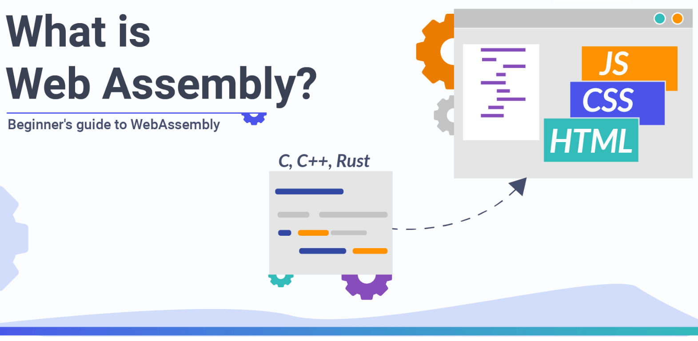

1. What is WebAssembly (aka wasm)?
   I like to think of WebAssembly as a "complier" for the web. If you've used any language like C then you know how you complie your code into machine code first? Well, wasm does almost the same thing but for the web.
2. What does it do?
   It "converts" code written in supported languages (Rust, C/C++, etc.) to specifically formatted bytecode (aka "machine code") which browsers can understand.
3. Why use wasm?
   It's fast!!
   We all know that static languages like C are much faster than dynamic languages like Javascript. Wasm enables a way use code written in C on the web so that perfomance is transferred as well.
   There are tons of other sophisticated things that happen under the hood which makes code "compiled" using wasm almost 10.9x faster! (according to experiments by Mozilla)
4. How do I use it?
   Wasm isn't meant to replace JS. There are many things that you can't do with other languages that you can with JS, so the apps or modules written in C++ or Rust won't be able to run on the web on its own. It has to be "glued" in, using JS.
5. If you have more questions then I highly suggest you go through their [FAQ](https://webassembly.org/docs/faq/).
6. If you have the time, I highly suggest you watch this. It's one of the best introductory talks about WebAssembly. Also goes more in-depth into the byte code part of wasm. (although a bit-dated)

[WebAssembly Demystified: What It Means For NodeJS](https://www.youtube.com/watch?v=2TdySRdQHOo)

7. Check out this repository for more up-to date information and for an enormous compilation of resources.

[mbasso/awesome-wasm](https://github.com/mbasso/awesome-wasm)
